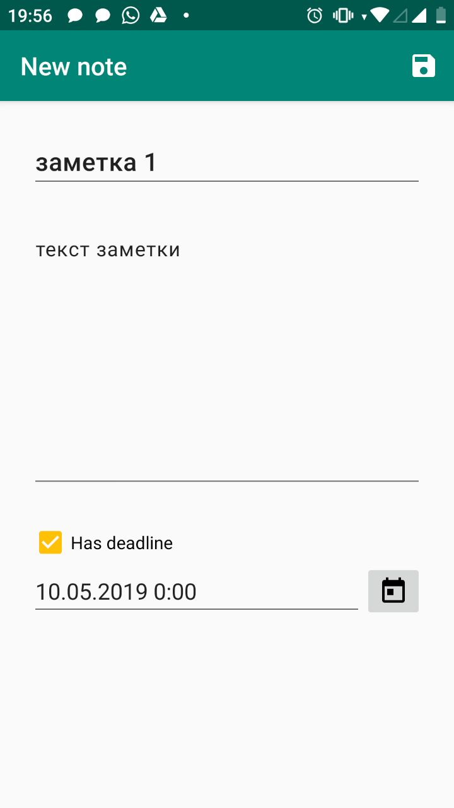
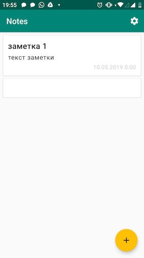
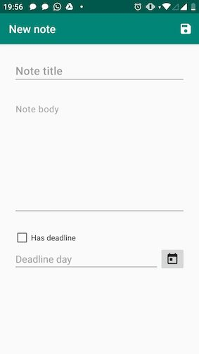
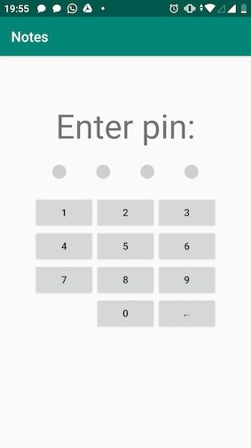
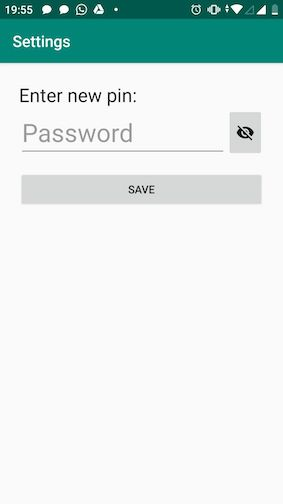
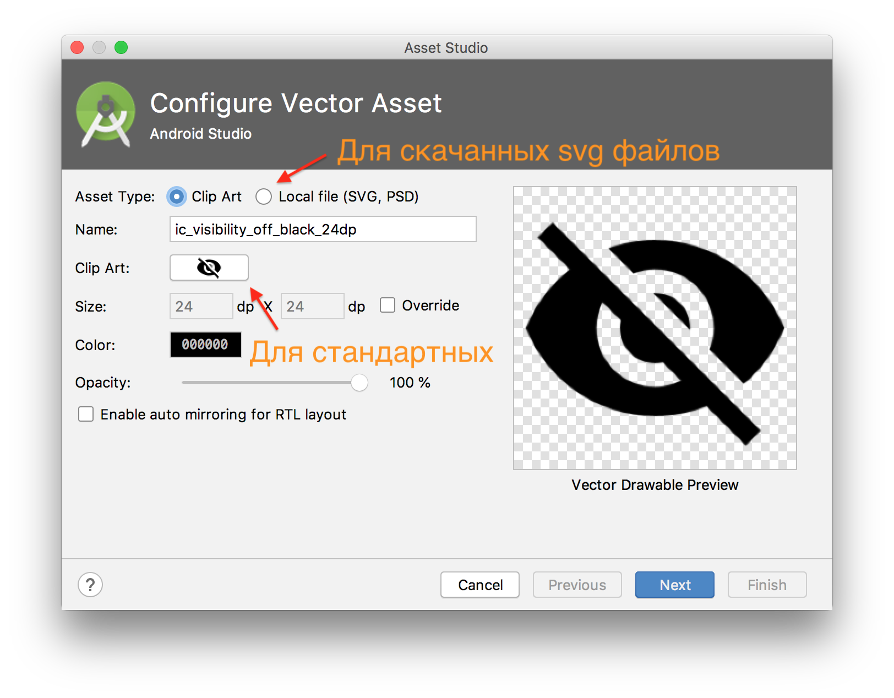

# Дипломная работа к профессии Android-разработчик

## Описание

Вы разрабатываете приложение заметок. Тестовый пример того, что у вас должно получиться вы можете скачать[здесь](https://play.google.com/apps/testing/ru.netology.notes) на свое Android-устройство.
Приложение позволяет:
* добавить новую текстовую заметку (с заголовком, текстовым содержанием, дедлайном):

* увидеть полный список заметок:

* добавить новую или отредактировать готовую заметку:

* при входе пользователь задает пароль:

* в настройках можно изменить пароль:

.

## Задача

Приложение включает: 
* Окно с вводом пароля;
* Окно с перечнем всех заметок;
* Окно с созданием/редактированием конкретной заметки;
* Окно с настройками.

## Этапы разработки

Этап 1.

Этап 2.

## Рекомендации

* Иконки использовать в векторном формате. Для этого правой кнопкой по папке drawable -> new -> vector asset. В демо приложении использовались стандартные иконки, которые уже есть в android studio (нажмите на кнопку с иконкой). Также можно импортировать другие иконки, например с сайтов [flaticon.com](https://flaticon.com), [icons8.com](https://icons8.com) и мой любимый [iconsvg.xyz](http://iconsvg.xyz). 
* Для того чтобы сделать каждую заметку в виде [CardView](https://material.io/design/components/cards.html):
    1. В build.gradle (app) подключаем зависимость `implementation 'com.google.android.material:material:1.1.0-alpha05'`;
    2. В xml разметке используем `androidx.cardview.widget.CardView` точно так же, как `FrameLayout`.
* [FAB](https://developer.android.com/guide/topics/ui/floating-action-button) (Floating Action Button) находится в библиотеке, которую мы уже подключили для `CardView`. Используется как обычный `Button`.
* В демо приложении подтверждение удаления заметки сделано с помощью [AlertDialog](https://developer.android.com/guide/topics/ui/dialogs#AlertDialog). Как и в примере из документации с помощью `new AlertDialog.Builder()` вы можете задать заголовок и текст диалога, а также с помощью методов `setPositiveButton` и `setNegativeButton` задать кнопки _подтвердить_ и _отмена_.
* Шифрование. Опционально(!), т.е. это дополнительное необязательное условие для выполнения дипломного проекта. В демо приложении оно не реализованно, но мне показалась неплохой вот эта статья на [code.tutsplus.com](https://code.tutsplus.com/tutorials/storing-data-securely-on-android--cms-30558), я бы начал с неё.

## Минимальные требования для получения зачета 

Работа будет принята, если:
* Приложение имеет весь заявленный функционал: 
    * создание;
    * редактирование;
    * удаление заметки;
    * отсортированный список заметок;
    * защита приложения пин-кодом.
* Код приложения написан в соответствии с Java code style:
    * никаких переменных `a` и `b1`;
    * названия классов с большой буквы;
    * названия методов с маленькой;
    * код отформатирован чудо сочетанием `Ctrl+Alt+L`;
    * и вот это вот всё, о чём говорили на лекциях и [писали туты](https://github.com/netology-code/codestyle/tree/master/java). 
* Весь код обязательно должен быть осмысленно разделен на несколько файлов: `Activity` не содержит в себе кода для сохранения/считывания файлов, кода для сортировки заметок.
* `OnCreate` не содержит логики обработки нажатий.
* Все строковые константы вынесены в `strings.xml`.
* Изменена иконка приложения.

### Как правильно задавать вопросы дипломному руководителю?

**Что следует делать, чтобы все получилось:**

* [Google.com](https://google.com):
    1. Попробовать найти ответ документации и исходном коде. Затем попробовать в интернете. Ведь, именно этот навык поиска ответов пригодится тебе на протяжении всей карьеры. 
    2. Попробовать ещё раз – ответ там точно есть.
    3. Попробовать задать вопрос на английском языке. 
    4. Написать руководителю как пыталась(ся) искать и почему то что нашлось не то что нужно.
* В одном вопросе должна быть заложена одна проблема.
* Если вопрос о визуальной части – обязательно прикрепить скриншот того как отображается сейчас + ссылку на xml верстку этого окна. Возможно вы найдете удобной для этого программу [prntscr](https://app.prntscr.com/ru/).
* Если нужно задать вопрос о небольшом участке кода, можно выложить на [gist.github.com](https://gist.github.com/) и отправить ссылку руководителю. Но предпочтительнее использовать следующий вариант.
* Задавать вопросы в комментариях к коду и присылать ссылку на GitHub с этой строчкой. (Если нажать на номер строки на GitHub в ссылку добавиться её номер, при последующем открытии браузер сразу перейдет к этой строке, например [github.com/.../ListViewActivity.java#L32](https://github.com/netology-code/and-homeworks/blob/master/4.1.listview/4.1.1/code/app/src/main/java/ru/netology/lists/ListViewActivity.java#L32)).
* Начинать работу над дипломом как можно раньше! Чтобы было больше времени на правки. 
* ~~Кушайте слона~~ делайте диплом по-частям – commit ваших изменений после  небольшого улучшения, фиксируя каждый раз проект в работающем состоянии.
* Сделайте сначала основной функционал, затем вернитесь к украшательству (отступы, цвета, иконки).

**Что следует делать, чтобы ничего не получилось:**

* Писать вопросы вида “Ничего не работает. Не запускается. Всё сломалось.”
* Молча скидывать неработающий проект.
* Откладывать диплом на потом.
* Игнорировать git и пытаться делать все наскоком, всё сломать и не помнить что было изменено с тех пор когда хоть что-то работало.
* Пытаться сделать сразу "красиво", "окончательно".
* Ждать ответ на свой вопрос моментально. Дипломные руководители - практикующие разработчики, которые занимаются, кроме преподавания, своими проектами. Их время ограничено, поэтому постарайтесь задавать правильные вопросы, чтобы получать быстрые ответы! 
