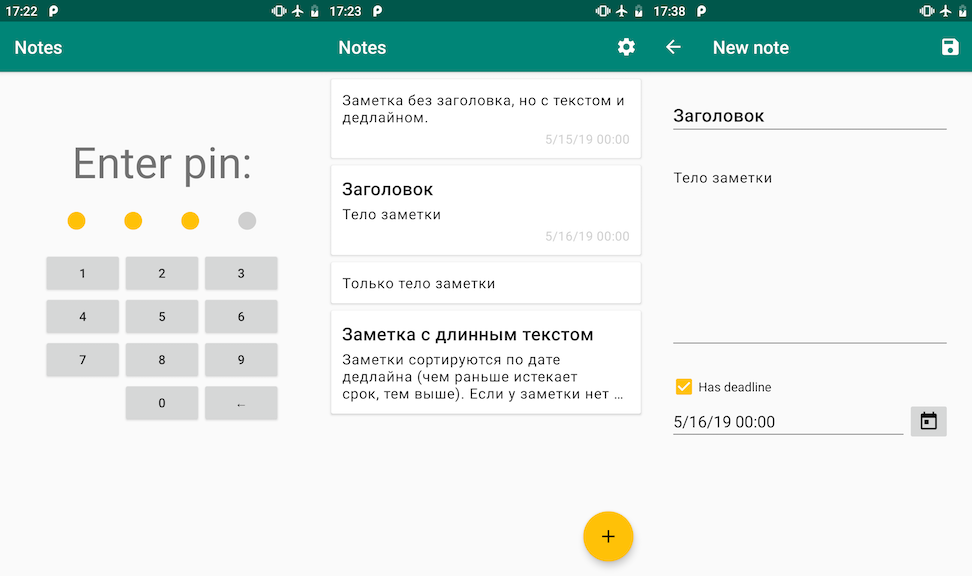

# Дипломная работа к профессии Android-разработчик

## Описание

Вы разрабатываете приложение заметок. Тестовый пример того, что у вас должно получиться вы можете скачать на свое Android-устройство.

**Приложение позволяет:**

* Добавить новую текстовую заметку: заголовок, текстовое содержание, дедлайн;
* Отредактировать существующую заметку;
* Просмотреть список сохраненных заметок;
* Ограничить доступ к заметкам с помощью пин-кода;
* Изменить пин-код в меню настроек.

## Разработка

> В следующих разделах приводится детальное описание функционала + возможный путь реализации. Настоятельно советую не читать сразу предложенное решение, а сначала подумать "а как сделали бы вы?", попробовать реализовать по своему. И лишь затем посмотреть, можно ли улучшить ваше решение с помощью предложенных приемов. 
> Текущий пример реализации не является "золотым стандартом" приложения заметок. Если у вас есть идеи, как сделать лучше и удобнее, используйте их – это более чем приветствуется! Важно лишь, чтобы эти улучшения не шли в разрез с тем, что от вас мы просим выполнить в этой работе.

Бизнес-логика:
* [Хранение заметок](pages/storage.md);
* [Хранение пин-кода](pages/keychain.md);
* [Внедрение зависимостей](pages/app.md).

Экраны: 
* [Окно с вводом пин-кода](pages/enter_pin.md);
* [Окно с перечнем всех заметок](pages/list.md);
* [Окно с созданием/редактированием заметки](pages/edit.md);
* [Окно с настройками](pages/settings.md).

> Если вы заметили ошибку в задании или работе демо приложения расскажите об этом дипломному руководителю.

## Рекомендации

* Иконки используйте в векторном формате. 
Для этого правой кнопкой по папке drawable -> new -> vector asset. В демо приложении использовались стандартные иконки, которые уже есть в Android Studio (нажмите на кнопку с иконкой). Также можно импортировать другие иконки, например с сайтов [flaticon.com](https://flaticon.com), [icons8.com](https://icons8.com) и мой любимый [iconsvg.xyz](http://iconsvg.xyz). 

* Для того чтобы сделать каждую заметку в виде [CardView](https://material.io/design/components/cards.html), нужно:
    1. В build.gradle (app) подключить зависимость `implementation 'com.google.android.material:material:1.1.0-alpha06'`;
    2. В xml разметке использовать `androidx.cardview.widget.CardView` точно так же, как `FrameLayout`.

* [FAB](https://developer.android.com/guide/topics/ui/floating-action-button) (Floating Action Button) находится в библиотеке, которую мы уже подключили для `CardView`. Используется как обычный `Button`.

* В демо приложении подтверждение удаления заметки сделано с помощью [AlertDialog](https://developer.android.com/guide/topics/ui/dialogs#AlertDialog). Как и в примере из документации с помощью `new AlertDialog.Builder()` вы можете задать заголовок и текст диалога, а также с помощью методов `setPositiveButton` и `setNegativeButton` задать кнопки _подтвердить_ и _отмена_.

## Минимальные требования для получения зачета 

Работа будет принята, если:

* Приложение имеет весь заявленный функционал: 
    * создание;
    * редактирование;
    * удаление заметки;
    * отсортированный список заметок;
    * защита приложения пин-кодом.

* Код приложения написан в соответствии с Java code style:
    * никаких переменных `a` и `b1`;
    * названия классов с большой буквы;
    * названия методов с маленькой;
    * код отформатирован чудо сочетанием `Ctrl+Alt+L`;
    * и вот это вот всё, о чём говорили на лекциях и [писали туты](https://github.com/netology-code/codestyle/tree/master/java). 

* Весь код обязательно должен быть осмысленно разделен на несколько файлов: `Activity` не содержит в себе кода для сохранения/считывания файлов, кода для сортировки заметок.

* `OnCreate` не содержит логики обработки нажатий.

* Все строковые константы вынесены в `strings.xml`.

* Изменена иконка приложения.

## Backlog, идеи для улучшения
* Подсвечивать заметки с прошедшим дедлайном – красным цветом, с дедлайном который истекает сегодня – желтым;
* Реализовать функционал Share. Чтобы пользователь мог нажав на кнопку отправить содержимое заметки другому человеку (через мессенджер или email).
* Использовать [безопасное хранилище](pages/keychain.md) пин-кода;
* Использовать [базу данных](pages/storage.md) для хранения заметок;
* Шифрование заметок. Мне показалась неплохой вот эта статья на [code.tutsplus.com](https://code.tutsplus.com/tutorials/storing-data-securely-on-android--cms-30558), я бы начал с неё. В базе данных _sqlite_ есть свои методы шифрования – [sqlchiper](https://github.com/sqlcipher/android-database-sqlcipher).

## Как правильно задавать вопросы дипломному руководителю?

**Что следует делать, чтобы все получилось:**

* [Google.com](https://google.com):
    1. Попробовать найти ответ документации и исходном коде. Затем попробовать в интернете. Ведь, именно этот навык поиска ответов пригодится тебе на протяжении всей карьеры. 
    2. Попробовать ещё раз – ответ там точно есть.
    3. Попробовать задать вопрос на английском языке. 
    4. Написать руководителю как пыталась(ся) искать и почему то что нашлось не то что нужно.
* В одном вопросе должна быть заложена одна проблема.
* Если вопрос о визуальной части – обязательно прикрепить скриншот того как отображается сейчас + ссылку на xml верстку этого окна. Возможно вы найдете удобной для этого программу [prntscr](https://app.prntscr.com/ru/).
* Если нужно задать вопрос о небольшом участке кода, можно выложить на [gist.github.com](https://gist.github.com/) и отправить ссылку руководителю. Но предпочтительнее использовать следующий вариант.
* Задавать вопросы в комментариях к коду и присылать ссылку на GitHub с этой строчкой. (Если нажать на номер строки на GitHub в ссылку добавиться её номер, при последующем открытии браузер сразу перейдет к этой строке, например [github.com/.../ListViewActivity.java#L32](https://github.com/netology-code/and-homeworks/blob/master/4.1.listview/4.1.1/code/app/src/main/java/ru/netology/lists/ListViewActivity.java#L32)).
* Начинать работу над дипломом как можно раньше! Чтобы было больше времени на правки. 
* ~~Кушайте слона~~ делайте диплом по-частям – commit ваших изменений после  небольшого улучшения, фиксируя каждый раз проект в работающем состоянии.
* Сделайте сначала основной функционал, затем вернитесь к украшательству (отступы, цвета, иконки).

**Что следует делать, чтобы ничего не получилось:**

* Писать вопросы вида “Ничего не работает. Не запускается. Всё сломалось.”
* Молча скидывать неработающий проект.
* Откладывать диплом на потом.
* Игнорировать git и пытаться делать все наскоком, всё сломать и не помнить что было изменено с тех пор когда хоть что-то работало.
* Пытаться сделать сразу "красиво", "окончательно".
* Ждать ответ на свой вопрос моментально. Дипломные руководители - практикующие разработчики, которые занимаются, кроме преподавания, своими проектами. Их время ограничено, поэтому постарайтесь задавать правильные вопросы, чтобы получать быстрые ответы! 

## Небольшое напутствие.

1. Предложите вашему дипломному руководителю пользоваться GitHub и в частности pull request для работы над диплом. Это знание пригодится вам на работе и будет плюсиком в резюме.
2. Выложите этот проект на GitHub в открытом доступе, причешите и принарядите его. Это будет Большим плюсом в резюме.
3. Вложите единоразово 25$ в ~~Google~~ корпорацию добра. Купите аккаунт Google Play разработчика и выложите ваше приложение в PlayMarket – это будет ОГРОМНЫМ плюсом при устройстве на работу.
