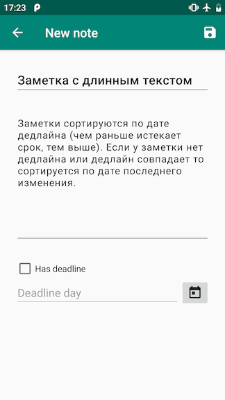

# Дипломная работа к профессии Android-разработчик

## Окно с созданием/редактированием заметки




Окно состоит из:
* Поля ввода заголовка заметки;
* Поля ввода тела заметки;
* Кнопки сохранить;
* Кнопки назад;
* _Checkbox'a_ есть ли дедлайн у заметки;
* Полем ручного ввода дедлайна;
* Кнопкой выбора даты.

Поведение:
* Это окно может открываться как для новой заметки, так и для редактирования существующей;
* Если поле пустое, то отображается _placeholder_ с подсказкой, для чего это поле;
* При снятии галочки дедлайна, поле дедлайн отчищается;
* При нажатии на кнопку выбора даты открывается стандартный диалог выбора даты из календаря.

**Реализация**

! Это лишь одно из возможных решений. Рекомендую читать его после того, как вы попробовали реализовать этот экран сами. !

Экран:
Контейнер – вертикальный `LinearLayout` обернутый в `ScrollView`. Для корректной работы не забудьте указать у `LinearLayout` свойство `layout_height=wrap_content`.

Текстовые поля:
Обратите внимание на свойства `hint` – для задания _placeholder'a_, `lines` - для задания высоты элемента, `inputType` – для отображения корректной клавиатуры (`text` или `textMultiline`).

Checkbox:
Можно воспользоваться `MaterialCheckBox`.

Ввод дедлайна:
Горизонтальный `LinearLayout` и заданный `layout_weight` для `EditText`.

Диалог выбора даты:
Воспользоваться `DatePickerDialog`.
```java
Calendar todayCalendar = Calendar.getInstance();
datePickerDialog = new DatePickerDialog(
        this,
        onDateSet,
        todayCalendar.get(Calendar.YEAR),
        todayCalendar.get(Calendar.MONTH),
        todayCalendar.get(Calendar.DAY_OF_MONTH)
);
datePickerDialog.show();
```
Вторым аргументом в конструктор `DatePickerDialog` мы передаем `DatePickerDialog.OnDateSetListener`, который будет вызван когда пользователь выберет дату. Подсказка – при нажатии нужно вызвать `datePickerDialog.dismiss()`, чтобы закрыть диалог.

Кнопка сохранить:
Это `OptionsMenu` от `Activity` с заданой иконкой и `app:showAsAction="always"`.

Кнопка назад:
Это стандартная кнопка от `Activity`, для того чтобы её отобразить `getSupportActionBar().setDisplayHomeAsUpEnabled(true);`. Обработка нажатия на неё происходит так же как и с кнопкой сохранить в `onOptionsItemSelected`, при нажатии будет передан `MenuItem` с `id` равным `android.R.id.home`.
