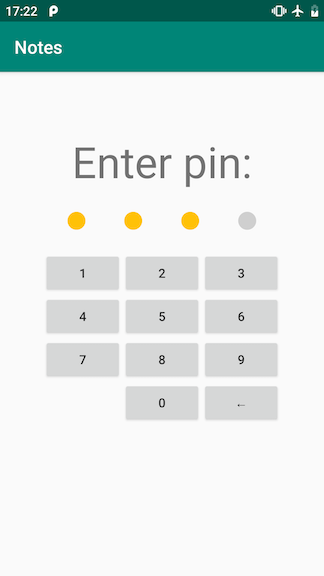

# Дипломная работа к профессии Android-разработчик

## Окно с вводом пин-кода

Окно состоит из:
* Placeholder'ы (кружочки), отображающие сколько цифр уже введено;
* Цифровая клавиатура + кнопка удалить;
* Текстовое поле для вывода ошибок.

Поведение:
* При нажатии на клавиатуру загорается дополнительный кружочек, в порядке слева направо;
* При нажатии на клавишу удалить, соответствующий кружок гаснет;
* При введении 4 цифр происходит проверка пин-кода с [хранилищем](keychain.md), если пин-код не верный – отображается ошибка;
* Если пин-код не был задан (первый запуск приложения) – перейти на [экран настроек](settings.md).

**Реализация**

! Это лишь одно из возможных решений. Рекомендую читать его после того как вы попробовали реализовать этот экран сами. !

Экран:
Контейнер для всего экрана – вертикальный `LinearLayout`.

Кружочки:
* Контейнер для кружочков – горизонтальный `LinearLayout`;
* Кружочки – просто `View` с `background` из `drawable/` [туц](https://google.com/search?q=android+drawable+circle);
* Чтобы сделать расстояние между кружочками, добавить между ними ещё `View`, но уже без `background` и задать им `layout_weight`.

Цифровая клавиатура:
* В основе `GridLayout` с элементами `Button`;
* Пустое место под цифрой 7 можно сделать или просто пустой `View` или с помощью `layout_columnSpan`;
* [пример туц](http://developer.alexanderklimov.ru/android/layout/gridlayout.php).

Ну и текстовое поле, оно и в Африке поле.
