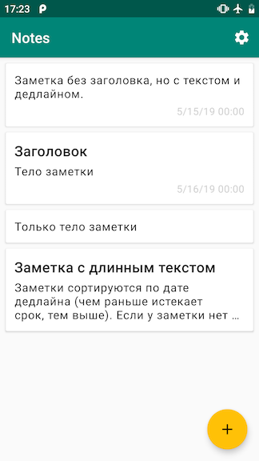
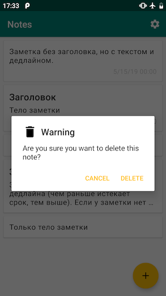

# Дипломная работа к профессии Android-разработчик

## Окно с перечнем всех заметок

Окно состоит из:
* Списка заметок в виде карточек;
* Кнопки добавить новую заметку;
* Кнопки настроек.

Поведение:
* Карточка состоит из 3 полей, если в заметку не внесены данные для этого поля оно не отображается (и не занимает место);
* В заголовке заметки отображается максимум 1 строка текста, иначе обрывается и знак `…`;
* В теле заметки отображается максимум 3 строчки, иначе обрывается и знак `…`;
* Для разных полей используются разные стили [туц](https://material.io/design/typography/the-type-system.html#applying-the-type-scale);
* При нажатии на кнопку добавить открывается пустое окно редактирования;
* При нажатии на элемент списка открывается окно редактирования этой заметки;
* При долгом нажатии на элемент появляется диалог подтверждения удаления.

**Реализация**

! Это лишь одно из возможных решений. Рекомендую читать его после того как вы попробовали реализовать этот экран сами. !

Экран:
Контейнер – `FrameLayout` так как нам нужно уместить и список и кнопку добавить.

Кнопка настройки:
Это `OptionsMenu` от `Activity` с заданой иконкой и `app:showAsAction="always"`.

Список:
`ListView` со своим адаптером.

Кнопка добавить:
FAB (Floating Action Button). Работает как обычная кнопка, иконку можно задать с помощью свойства `src` (как у `ImageView`).

Элемент списка:
* `CardView` для тени и скругленных краев, вертикальный `LinearLayout` внутри;
* Задавать стандартные стили для текста с помощью `style` или `textAppearance` (например `style="@style/TextAppearance.MaterialComponents.Headline6"`);
* Чтобы ограничить максимальное количество строчек текста - `maxLines`, чтобы поставить `…` в конце при нехватке места – `ellipsize`.
* Прятать неиспользуемые поля с помощью `View.GONE`;
* Обычное нажатие обрабатывать через `setOnItemClickListener`, долгое через `setOnItemLongClickListener`;
* Переход на экран редактирования – `Intent` с _extra_ содержащим id заметки для редактирования;
* Диалог подтверждения удаления – смотри рекомендации на главной.