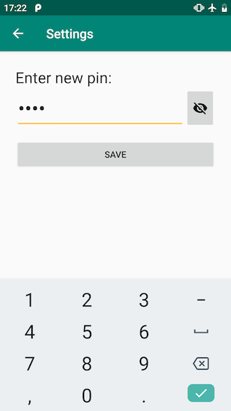

# Дипломная работа к профессии Android-разработчик

## Окно настроек

Окно состоит из:
* Заголовок;
* Поля ввода пин-кода;
* Кнопка показать/скрыть пин-код;
* Кнопка сохранить;
* Текстовое поле с ошибкой.

Поведение:
* Текстовое поле позволяет ввести максимум 4 цифры;
* Когда текстовое поле пустое, отображается _placeholder_;
* При вводе используется системная клавиатура из цифр;
* По умолчанию введенные цифры скрываются кружочками;
* При нажатии на кнопку пин-код отображается/скрывается;
* При нажатии на сохранить, приложение запоминает новый пин-код.

**Реализация**

! Это лишь одно из возможных решений. Рекомендую читать его после того как вы попробовали реализовать это. !

Экран:
Вертикальный `LinearLayout`.

Поле ввода и кнопка:
* Горизонтальный `LinearLayout`, у `EditText` задан `layout_weight`;
* Для кнопки используется `ImageButton`;
* Для ограничения максимальной длинны ввода используется свойство `maxLength`;
* Для смены вида клавиатуры используется свойство `inputType`. Для ввода цифр и скрытия их за кружочками значение `numberPassword`, для открытого ввода цифр `number`.

Кнопка сохранить:
Если введено ровно 4 цифры передаем их в `Keystore`, иначе отображаем ошибку.
